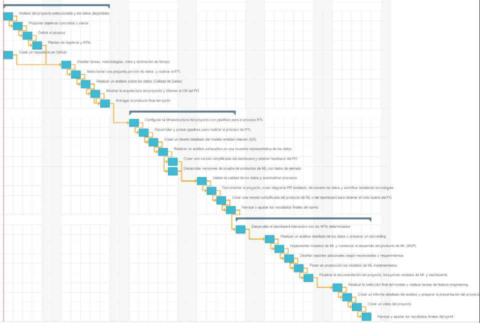

# PF_GOOGLE_YELP

  

### Nuestro equipo
Nuestro equipo de expertos está constantemente actualizado en las últimas tendencias y tecnologías del mercado laboral para brindar soluciones prácticas y efectivas para nuestros clientes. En LATAM , estamos comprometidos con el éxito de nuestros clientes. 

+  -  Data Engineer
+  - Data Analyst
+  - Data Scientist
+  - Data Engineer
+  - Data Scientist
  
## Objetivos

1. Identificar las categorías de hoteles con potencial de mayor y menor crecimiento a través del análisis de opiniones en plataformas como Yelp y Google Maps

2. Detectar Sitios Óptimos para Nuevos Hoteles utilizando datos de opiniones para identificar las ubicaciones geográficas más estratégicas para la apertura de nuevos establecimientos.

3. Establecer un sistema de sugerencias basado en las preferencias y experiencias anteriores de los usuarios en ambas plataformas.

## KPIs

1. Reducir el 6% de las estrellas de 1 y 2 del sector hotelero con respecto a cada año
2. Aumentar el 5% de la cantidad de reviews en hoteles con respectos cada año
3. Aumentar en un 6% los reviews positivos en hoteles con respecto a cada año
4. Incremento de un 10% del total de reviews del año actual respecto del año anterior (Refleja un aumento de popularidad).

## Alcance

Conforme a los requerimientos del cliente, el proyecto se orienta hacia el ámbito turístico, centrándose específicamente en las categorías de alojamiento, con énfasis en hoteles, en los Estados Unidos. Dada la extensa diversidad estatal en este país, se ha llevado a cabo una investigación para identificar y diseñar estrategias acordes con los objetivos de la empresa contratante. Se ha determinado que, según datos recopilados por el Departamento de Comercio de los Estados Unidos (disponible en https://www-trade-gov.translate.goog/data-visualization/us-states-cities-visited-overseas-travelers?_x_tr_sl=en&_x_tr_tl=es&_x_tr_hl=es&_x_tr_pto=sc), los cinco estados más concurridos por turistas en el año 2022 fueron Florida, Nueva York, California, Nevada y Texas. Este análisis abarca el período desde el año 2016 hasta el 2022.

## Solución Propuesta

### Metodología de Trabajo

  

En el desarrollo de nuestro proyecto, hemos decidido implementar la metodología Scrum, reconocida por su capacidad para gestionar proyectos de manera ágil y eficiente. Scrum proporciona un marco de trabajo flexible que se adapta a las necesidades cambiantes del proyecto, permitiendo una respuesta rápida a los requisitos del cliente y facilitando la entrega continua de productos de alta calidad. Esta metodología se basa en la colaboración constante entre los miembros del equipo, la transparencia en la comunicación y la capacidad de adaptación a medida que evolucionan los objetivos del proyecto. Al adoptar Scrum, buscamos optimizar la productividad, mejorar la comunicación interna, y asegurar una entrega más rápida y efectiva de soluciones que cumplan con las expectativas del cliente. La planificación y revisión regular de sprints en Scrum nos permitirán mantener un enfoque iterativo y centrado en el valor, maximizando así la satisfacción del cliente y la eficiencia del equipo de desarrollo.

### Estimación de Tiempos

  

Para la estimación de tiempo se elaboro un diagrama de gantt ubicado dentro de la carpeta assets/gant.pdf en el cual se establecio que tendra tres sprint con duración de una semana por cada sprint, del cual se tiene un comienzo el 2 de Enero y la finalización el 20 del mismo mes.
Cada Sprint cuenta con sus actividades y tareas para los miembros del equipo.

### Roles del Equipo

### Stack Tecnológico
