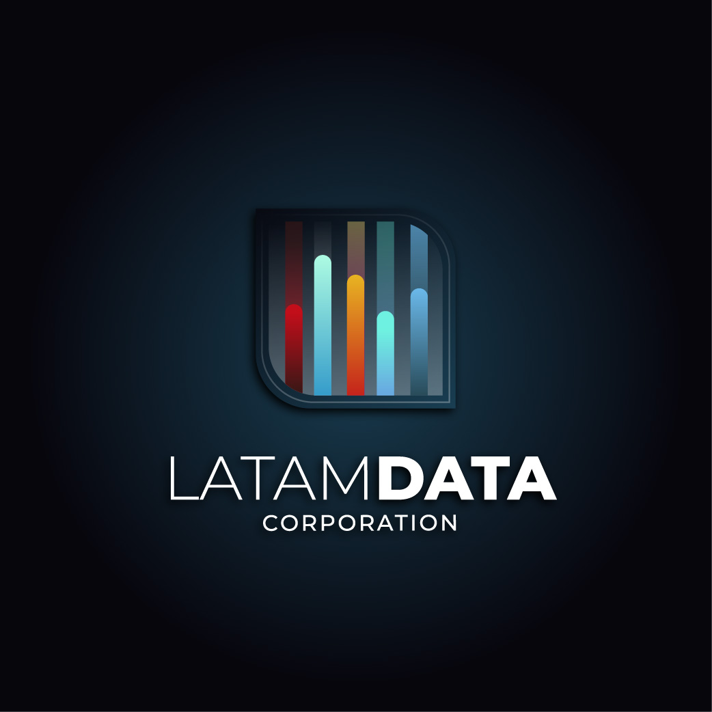
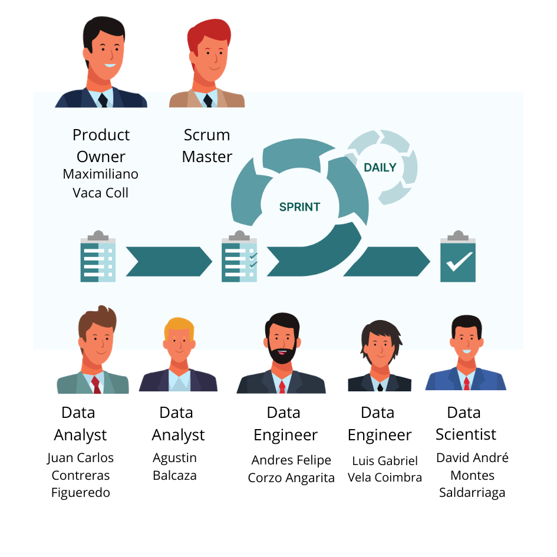
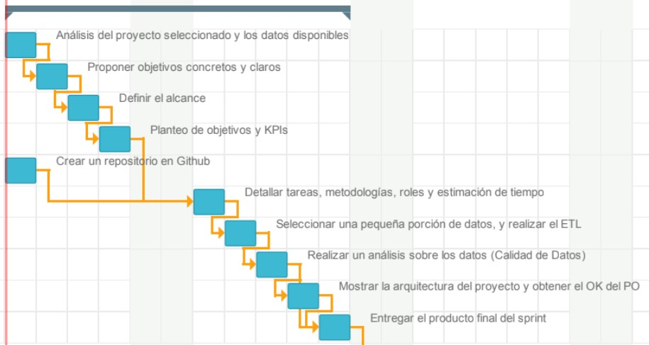
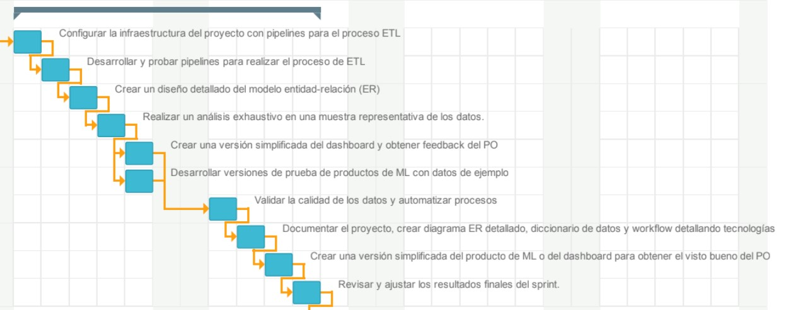
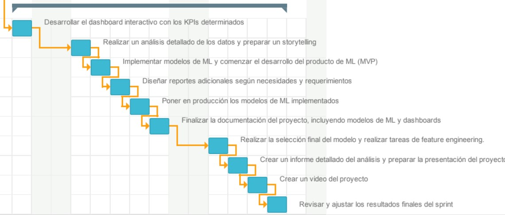

# PF_GOOGLE_YELP

  

## Indice

  
Tabla de contenido: 

  <ol>
    <li>
      <a href="#LATAMDATA">LATAMDATA</a>
      <ul>
        <li><a href="#Quienes-somos">¿Quienes somos?</a></li>
      </ul>
    </li>
    <li>
      <a href="#Planteamiento-del-problema">Planteamiento del problema</a>
    </li>
    <li>
      <a href="#Propuesta-de-proyecto">Propuesta de proyecto</a>
      <ul>
        <li><a href="#Objetivos">Objetivos</a></li>
        <li><a href="#kpis">KPIs</a></li>
        <li><a href="#Alcance">Alcance</a></li>
        <li><a href="#Stack-tecnológico">Stack tecnológico</a></li>
      </ul>
      <li><a href="#Solución Propuesta">Solución Propuesta</a></li>
      <ul>
        <li><a href="#Metodología-de-trabajo">Metodología de trabajo</a></li>
        <li><a href="#Estimación de Tiempos">Estimación de Tiempos</a></li>
        <li><a href="#Roles del Equipo">Roles del Equipo</a></li>
        <li><a href="#Stack-tecnologico">Stack Tecnológico</a></li>
        <li><a href="#Workflow">WorkFlow</a></li>
    </li> 
  </ol>

## LATAMDATA

### ¿Quienes somos?

Somos LATAM DATA CORPORATION, una consultora líder con sólida experiencia y vanguardia en diversos sectores industriales. Nuestro enfoque se centra en proporcionar a nuestros clientes soluciones avanzadas y personalizadas en análisis de datos, inteligencia empresarial y modelado predictivo. Colaboramos estrechamente con nuestros clientes para identificar las habilidades y conocimientos esenciales que serán cruciales en el panorama empresarial futuro.

## Planteamiento del problema

La empresa perteneciente al conglomerado hotelero que nos contrata cuenta con una trayectoria de décadas en la industria, han mantenido un compromiso firme con la satisfacción del cliente y la mejora continua, a pesar de su vasta experiencia en la industria hotelera, se encuentra en un momento de incursión en diversas subcategorías del sector. Esta expansión los ha llevado a explorar oportunidades en diferentes tipos de alojamiento, desde hoteles boutique hasta resorts de lujo y alojamientos temáticos. Esta amplia gama de opciones ha generado una mayor complejidad a la hora de comprender las preferencias y expectativas de los clientes en cada segmento. Por tanto, su interés radica en utilizar las opiniones y reseñas disponibles en plataformas como Google Maps y Yelp para orientar sus decisiones de inversión hacia las áreas que prometen un mayor potencial y demanda por parte de los usuarios. Por lo tanto, el desafío implica la recopilación, el procesamiento y la interpretación de grandes volúmenes de datos, así como la implementación de algoritmos inteligentes para ofrecer recomendaciones precisas y valiosas.

## Propuesta de proyecto

### Objetivos

1. Identificar las categorías de hoteles con potencial de mayor y menor crecimiento a través del análisis de opiniones en plataformas como Yelp y Google Maps

2. Detectar Sitios Óptimos para Nuevos Hoteles utilizando datos de opiniones para identificar las ubicaciones geográficas más estratégicas para la apertura de nuevos establecimientos.

3. Establecer un sistema de sugerencias basado en las preferencias y experiencias anteriores de los usuarios en ambas plataformas.

### KPIs

1. Tasa anual de satisfacción de los reviews: Calcula el porcentaje de calificaciones positivas por categoría hotelera que recibió. Es útil para medir la reputación de cada categoría y determinar la mejor.
2. Tasa anual de gastos en turismo: Calcula el porcentaje de gastos del turismo por estado. Es útil para ver el aumento del gasto en turismo.
3. Tasa de Crecimiento de Categoría Hotelera: Mide el crecimiento de cada categoría de la industria hotelera por estado con respecto al año anterior. Para determinar la categoría con mayor y menor crecimiento dependiendo del Estado.
4. Tasa de Ocurrencia: Mide la cantidad de reviews por estado y categorías con respecto al año anterior y así poder determinar el estado con mayor visitas por parte de los usuarios.

### Alcance

Conforme a los requerimientos del cliente, el proyecto se orienta hacia el ámbito turístico, centrándose específicamente en las categorías de alojamiento, con énfasis en hoteles, en los Estados Unidos. Dada la extensa diversidad estatal en este país, se ha llevado a cabo una investigación para identificar y diseñar estrategias acordes con los objetivos de la empresa contratante. Se ha determinado que, según datos recopilados por el Departamento de Comercio de los Estados Unidos (disponible en https://www-trade-gov.translate.goog/data-visualization/us-states-cities-visited-overseas-travelers?_x_tr_sl=en&_x_tr_tl=es&_x_tr_hl=es&_x_tr_pto=sc), los cinco estados más concurridos por turistas en el año 2022 fueron Florida, Nueva York, California, Nevada y Texas. Este análisis abarca el período desde el año 2016 hasta el 2022.

## Solución Propuesta

### Metodología de Trabajo

  

En el desarrollo de nuestro proyecto, hemos decidido implementar la metodología Scrum, reconocida por su capacidad para gestionar proyectos de manera ágil y eficiente. Scrum proporciona un marco de trabajo flexible que se adapta a las necesidades cambiantes del proyecto, permitiendo una respuesta rápida a los requisitos del cliente y facilitando la entrega continua de productos de alta calidad. Esta metodología se basa en la colaboración constante entre los miembros del equipo, la transparencia en la comunicación y la capacidad de adaptación a medida que evolucionan los objetivos del proyecto. Al adoptar Scrum, buscamos optimizar la productividad, mejorar la comunicación interna, y asegurar una entrega más rápida y efectiva de soluciones que cumplan con las expectativas del cliente. La planificación y revisión regular de sprints en Scrum nos permitirán mantener un enfoque iterativo y centrado en el valor, maximizando así la satisfacción del cliente y la eficiencia del equipo de desarrollo.

### Estimación de Tiempos

#### Sprint 1

  

#### Sprint 2

  

#### Sprint 3

  

Para la estimación de tiempo se elaboro un diagrama de gantt ubicado dentro de la carpeta assets/gant.pdf en el cual se establecio que tendra tres sprint con duración de una semana por cada sprint, del cual se tiene un comienzo el 2 de Enero y la finalización el 19 del mismo mes.
Cada Sprint cuenta con sus actividades y tareas para los miembros del equipo.

### Roles del Equipo

Nuestro equipo de expertos está constantemente actualizado en las últimas tendencias y tecnologías del mercado laboral para brindar soluciones prácticas y efectivas para nuestros clientes. En LATAMDATA, estamos comprometidos con el éxito de nuestros clientes.

- [Luis Gabriel Vela Coimbra]() - Data Engineer
- [Andres Felipe Corzo Angarita ]() - Data Engineer
- [Juan Carlos Contreras Figueredo ]() - Data Analyst
- [Agustin Balcaza]() - Data Analyst
- [David Andre Montes Saldarriaga ]() - Data Scientist

### Stack Tecnológico

  

#### Fundamentacion

##### Python con bibliotecas como Pandas, Seaborn, NumPy, Matplotlib, Scikit-learn y Streamlit:

Pandas: Es una biblioteca de manipulación y análisis de datos que proporciona estructuras de datos potentes y herramientas para trabajar con conjuntos de datos estructurados, facilitando tareas como limpieza, transformación y análisis.

NumPy: Proporciona estructuras de datos para trabajar con matrices multidimensionales y funciones matemáticas de alto nivel para operar con estas matrices. Es fundamental para operaciones numéricas eficientes.

Matplotlib: Es una librería de trazado de gráficos que permite generar visualizaciones estáticas, ofreciendo un alto grado de control sobre la apariencia de los gráficos.

Seaborn: Construida sobre Matplotlib, Seaborn proporciona una interfaz de alto nivel para crear visualizaciones estadísticas atractivas y detalladas. Es útil para la exploración rápida de datos y la creación de gráficos más complejos.

Scikit-learn: Ofrece herramientas para aprendizaje automático y modelado estadístico. Proporciona una gama de algoritmos y utilidades para tareas de clasificación, regresión, agrupamiento, entre otras.

Streamlit: Streamlit es una biblioteca de Python que permite crear aplicaciones web interactivas de manera rápida y sencilla. Está diseñado para facilitar a científicos de datos y desarrolladores la creación de interfaces de usuario para visualizar y compartir datos de manera efectiva. La premisa fundamental de Streamlit es proporcionar una experiencia de desarrollo minimalista, donde el código para crear aplicaciones sea simple y directo.

##### Google Cloud Platform (GCP) con herramientas como Storage, Cloud Functions, BigQuery, Scheduler, App Engine y Cloud SDK:

Google Cloud Storage: Ofrece almacenamiento escalable y seguro para objetos, permitiendo almacenar y acceder a grandes cantidades de datos de forma eficiente.

Google Cloud Functions: Permite ejecutar código en respuesta a eventos en la nube sin necesidad de aprovisionar o administrar servidores, ideal para aplicaciones serverless y microservicios.

BigQuery: Es un servicio de almacenamiento y análisis de datos totalmente administrado que permite consultar grandes conjuntos de datos usando SQL de forma rápida y escalable.

Cloud Scheduler: Cloud Scheduler es un servicio completamente administrado que te permite programar trabajos en GCP, de manera que puedas automatizar la ejecución de tareas recurrentes y planificadas. Algunos de los casos de uso comunes incluyen la ejecución de trabajos de procesamiento de datos, la activación de funciones en Cloud Functions y la actualización periódica de recursos en la nube.

App Engine: App Engine es un servicio de plataforma como servicio (PaaS) que te permite desarrollar y alojar aplicaciones web escalables sin preocuparte por la administración de la infraestructura subyacente. Es compatible con varios entornos de ejecución, incluidos Python, Java, Node.js y más.

Cloud SDK: Cloud SDK es un conjunto de herramientas de línea de comandos que facilitan la interacción con los productos y servicios de Google Cloud. Proporciona comandos para gestionar recursos, realizar despliegues y automatizar tareas administrativas en GCP.

##### Power BI:

Es una plataforma de análisis empresarial que permite visualizar datos y compartir información de manera interactiva y atractiva. Conecta con una variedad de fuentes de datos, incluyendo bases de datos en la nube o locales, y proporciona herramientas para crear informes dinámicos y cuadros de mando.

La combinación de estos componentes permite desde la manipulación y análisis avanzado de datos en Python, pasando por el almacenamiento y procesamiento en la nube con GCP, hasta la visualización interactiva y la generación de informes con Power BI. Esto facilita la creación de soluciones completas desde la adquisición y procesamiento de datos hasta la presentación y toma de decisiones basada en análisis detallados.

### Workflow

Dada la prominencia que goza Google Cloud Platform (GCP), junto con el acceso a documentación actualizada y precisa, así como la extensa variedad de soluciones que proporciona en su plataforma, desde el almacenamiento y procesamiento de datos hasta el análisis predictivo y la visualización, hemos optado por elegirlo.

- Fuentes de Datos: Archivos planos + Webscrapping
- Integración: Cloud Functions en Google Cloud Platform
- Almacenamiento: Google Cloud Storage
- Data Warehouse: BigQuery en Google Cloud Platform
- Machine Learning: Google Cloud SDK + App Engine
- Visualización: Power Bi
